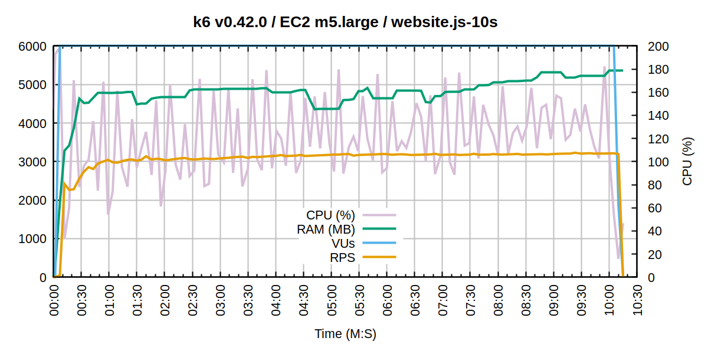

# k6 v0.42.0 benchmark results

## EC2 m5.large

### website.js - 10s `sleep` per iteration

- VUs reached (max): 6,000
- Memory used (avg): 4.72 GB
- CPU load (avg): 1.20 (out of 2.0)
- RPS (max): 3,229.67

## EC2 m5.4xlarge

### website.js - 6s `sleep` per iteration

- VUs reached (max): 20,000
- Memory used (avg): 16.16 GB
- CPU load (avg): 7.10 (out of 16.0)
- RPS (max): 19,159.98

## EC2 m5.24xlarge

### website.js - 1s `sleep` per iteration

- VUs reached (max): 30,000
- Memory used (avg): 22.58 GB
- CPU load (avg): 44.43 (out of 96.0)
- RPS (max): 59,706.51

### RPS-optimized.js

- VUs reached (max): 60,000
- Memory used (avg): 21.65 GB
- CPU load (avg): 72.03 (out of 96.0)
- RPS (max): 161,651.73

### file-upload.js

- VUs reached (max): 1,000
- Memory used (avg): 11.29 GB
- CPU load (avg): 2.94 (out of 96.0)
- Network throughput (max): 1.2 GB/s
- Data transferred (total): 99 GB

Note that this test was bottlenecked by the available network bandwidth, as k6 was able to saturate the full 10Gbps link.
